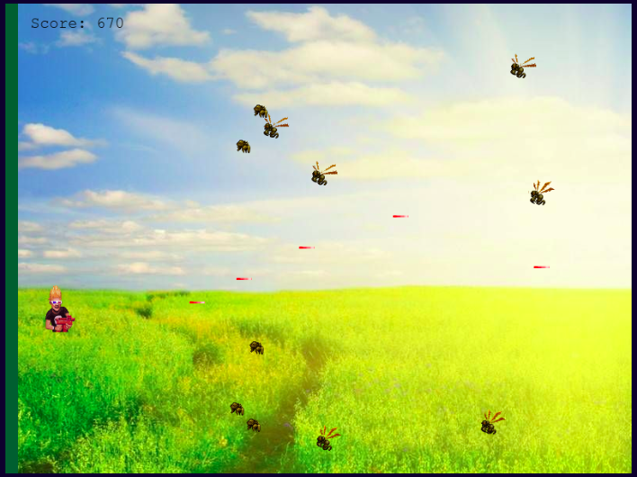
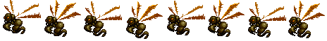
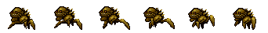

# Hunting-Predators

> Terminate as many predators as you can. If your body (player) collides with any of the aliens, game over. If Any of the predators make it to your farm (touches the green vertical line to the left), game over!
> Try to survive and kill as many predators as you can to bring your name into the high scores list.

- [Jump To: How to Use](#usage)
- [Jump To: How to Play](#gameplay)
- [Jump To: How This Game Designed](#howdesigned)
- [Jump To: Tests](#tests)
- [Jump To: Future Features](#futurefeatures)
- [Jump To: Contributing](#contributing)

## Live Demo

[Live Demo Link](https://star-fall.netlify.app/)

## Built With

- JavaScript
- Phaser
- Webpack
- Netlify
- Jest

## Getting Started

### Prerequisites

- An updated web browser.
- Node.js CLI (If you wish to run the game on your local PC).

### Usage

- Click the [Live Demo Link](https://star-fall.netlify.app/) to play the game.

### Running on Local PC

##### To run the game on your local PC, Open your command prompt (Terminal) and follow the instructions below:
_On your terminal, execute the following `commands`:_
- Clone the repository: `git clone https://github.com/teekaytech/Hunting-Predators.git`
- Navitage into the repository root folder with `cd Hunting-Predators`
- Install the dependencies with `npm install`
- Start the game with `npm run start`

 

### How to Play

#### Controls

##### Use arrow keys on your keyboard to play move the player around

- Left: Make the player accelerates towards left
- Right: Make the player accelerates towards right
- Up: Make the player accelerates upward
- down: Make the player accelerates downward
- Spacebar: Make the player shoots

### Logic

- Your goal as a player is to kill as many predators as you can, without coming in contact with the aliens.

**Predators**

**Aliens**

- As you avoid coming in contact with the aliens, you must also ensure that the predators never make it to your farm (the green vertical line to the right).
- With every predator you kill, your score is increased by 10points.
- Your objective is to survive with the highest possible score.

### Input Your Name

- Although you can play the game without giving your name, doing so makes you stand a chance of making your name show on the scoreboard.
- If you are on the top 15, you can see yourself in the list.

 

### How this game was developed

#### Introduction

> My goal was to create a platform game (e.g. space shooter game) where a character can move around shooting the enemies.

#### Story and Gameplay

> I'm not the game type. In fact, I barely play games. This is because I hardly find games interesting. For that reason, it was a bit difficult for me to come up with a story. I came up with this story after getting some inspiration from a local movie I watched in the past. In that movie, the farmers in a particular community decided to hire some hunters to watch their farm for them against some predators. These predators are not killed by traps or poisons. So they believe that the hunters will kill the predators for them. From this, I was able to make the character kill the predators as they appear randomly. There's also a character of aliens: there are not here for the farm, they're here to eliminate the hunber. I designed the game in such a way that if any of the predators make it to the farm, the game is over. Also, if the aliens come in contact with the hunter, the game is over.

#### Choice of Assets

> In other to achieve the set goals, I used assets like the farm, background, predator spritesheet, aliens spritesheet and I chose one of the audio file found in a tutorial as background music.

#### Technical Knowhow

> understanding Phaser was a bit of a challenge. Therefore, I used the official documentation from Phaser. More often than none, I checked out a lot of examples from Phaser website and a couple of youtube videos.

#### Development Stage

> Since the goal is set, the design has been made and the assets ready to use, I started the development phase.

> I started by creating the different scenes in my game. This gives me some level of confidence because within the first few hours, I already have a deliverable.

> After that, I picked the scenes one after the other and added I preloaded the required assets. I also link the scenes all together according to the game design, so I can move freely from one scene to another.

> Next, I focused on the game scene, as this is the most complicated scene of all. I added logics to render player, farm, background, predators and aliens. I also added logics to animate predators, aliens and to make their movement. Having done these, I added logic to move the player around and to make the player shoot.

> I later added logics to monitor collision between the player and the aliens, predators and farms, shootings and predators. Lastly in the game scene, I added the score mechanism to keep track of each game session's scores.

> A player do not have to enter his/her name before playing the game. If a player did not enter his/her name, the only implication is that their score will not be stored in the game board.

 

### Testing the Game

_To test the game, run the following commands on your terminal:_
- Clone the repository: `git clone https://github.com/teekaytech/Hunting-Predators.git`
- Navitage into the repository root folder with `cd Hunting-Predators`
- Install the dependencies with `npm install`
- Start the game with `npm run test`

### Future Features

- Level System
- Mobile compatibility.
- Selecting player character.
- Add animation and sound when predators are shot.

## Author

👤 **Taofeek Olalere**

- Github: [@teekaytech](https://github.com/teekaytech)
- Twitter: [@ola_lere](https://twitter.com/ola_lere)
- Linkedin: [olaleretaofeek](https://linkedin.com/in/olaleretaofeek)
- Portfolio: [Olalere Taofeek](https://teekaytech.github.io/olaleretaofeek/)

 

## 🤝 Contributing

Contributions, issues and feature requests are welcome!

Feel free to check the [issues page](issues/).

## Show your support

Give a ⭐️ if you like this project!

## Acknowledgements

- [Video Game Project](https://docs.idew.org/video-game/project-outline/1-5-phaser-practice-1-matching-game/p1-steps-1-5)
- [Luis Zuno Phaser Tutorial on Youtube](https://www.youtube.com/playlist?list=PLDyH9Tk5ZdFzEu_izyqgPFtHJJXkc79no)
- [phasertutorials.com](https://phasertutorials.com/creating-a-phaser-3-template-part-1/)
- [Phaser 3 Examples](https://labs.phaser.io/index.html?dir=scenes/&q=)
- [Phaser official documentation](http://phaser.io/tutorials/making-your-first-phaser-3-game/part8)

## 📝 License

This project is [MIT](LICENSE) licensed.
